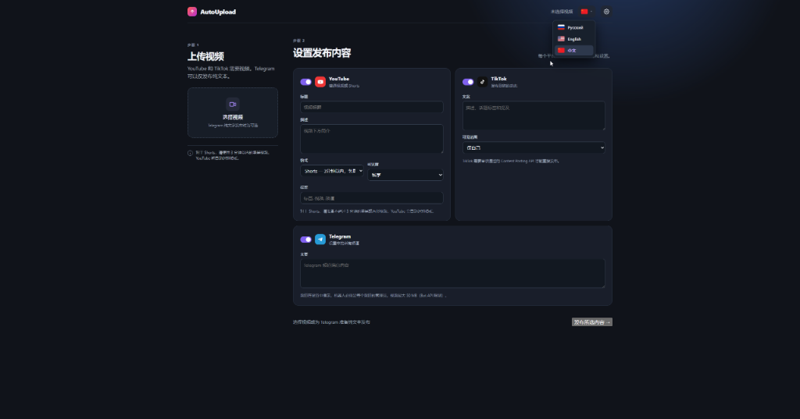
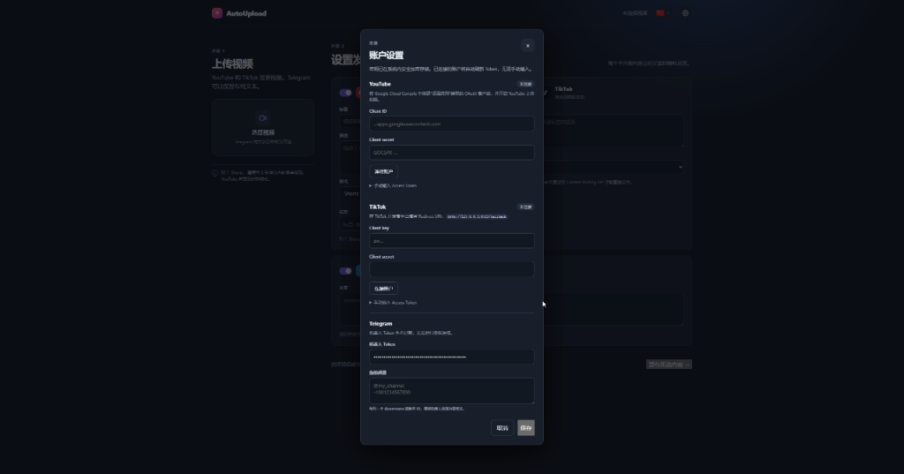

# Что из себя представляет AutoUpload ?

AutoUploader - приложение для одновременной отправки своего видео в YouTube (включая Shorts), TikTok и Telegram-каналы. Для каждой платформы можно задать отдельный текст и уровень видимости.
Создавалось с целью облегчения работы в плане опубликации рекламы 

Программа имеет очень понятный и простой интерфейс и поддержку русского, английского и китайского языков

## Скриншоты / Screenshots

<p align="center">
  
  
</p>

## Запуск разработки

Нужна Node.js 20 или новее.

```bash
npm install
npm start
```

## Сборка приложений

```bash
npm run package:mac  # macOS .dmg
npm run package:win  # Windows .exe
```

Готовые установщики появятся в папке `dist`.

## Подключение аккаунтов

В приложении откройте кнопку `⚙`. Всё, что вы туда внесёте, сохраняется в зашифрованном хранилище ОС, а не в исходном коде.

- **YouTube:** создайте OAuth-клиент типа **Desktop app** в Google Cloud Console, вставьте Client ID и Client secret и нажмите «Подключить аккаунт». Дальше приложение обновляет токен само.
- **TikTok:** зарегистрируйте приложение в TikTok for Developers, укажите в нём redirect URI `http://127.0.0.1:8723/callback`, вставьте Client key и Client secret и нажмите «Подключить аккаунт». Для автоматической публикации приложение TikTok должно быть одобрено для Content Posting API; это правило TikTok нельзя обойти кодом.
- **Telegram:** создайте бота через [@BotFather](https://t.me/BotFather), получите token и добавьте бота администратором в каждый свой канал. В поле каналов укажите `@username` или числовой ID — по одному на строку. Видео крупнее 50 МБ Bot API не принимает.

У YouTube и TikTok остались запасные поля для ручного access token — на случай, если оформлять OAuth-клиент не хочется. Такой токен живёт около часа и сам не обновляется.


## Как устроено

- `src/main.js` — окно, IPC и сборка задания на публикацию;
- `src/config.js` — чтение и запись настроек с шифрованием через `safeStorage`;
- `src/oauth.js` — OAuth с PKCE, локальный сервер для приёма redirect, обновление токенов;
- `src/platforms/` — по файлу на площадку; видео уходит кусками, поэтому память не зависит от размера ролика.


# What is AutoUpload?

AutoUploader is an application for simultaneously sending your video to YouTube (including Shorts), TikTok, and Telegram channels. You can set a separate text and visibility level for each platform. It was created to make work easier in terms of publishing ads.

The program has a very intuitive interface and supports Russian, English, and Chinese.

## Development launch

Node.js 20 or later is required.

```bash
npm install
npm start
```

## Building applications

```bash
npm run package:mac # macOS .dmg
npm run package:win # Windows .exe
```

The finished installers will appear in the `dist` folder.

## Connecting accounts

In the application, open the `⚙` button. Everything you put in there is saved in the encrypted OS storage, not in the source code.

- YouTube: Create an OAuth client of the type **Desktop app** in the Google Cloud Console, paste the Client ID and Client secret, and click “Connect account.” After that, the app will automatically refresh the token.
- **TikTok:** register the app in TikTok for Developers, specify the redirect URI `http://127.0.0.1:8723/callback` in it, paste the Client key and Client secret, and click “Connect account”. For automatic posting, the TikTok app must be approved for the Content Posting API; this TikTok rule cannot be bypassed with code.
- **Telegram:** create a bot via [@BotFather](https://t.me/BotFather), get a token, and add the bot as an administrator to each of your channels. In the channels field, specify `@username` or numeric ID — one per line. The Bot API does not accept videos larger than 50 MB.

 YouTube and TikTok still have spare fields for a manual access token — in case you don’t want to set up an OAuth client. Such a token lasts about an hour and is not automatically renewed.


 ## How it works

- `src/main.js` — window, IPC, and build task for publishing;
- `src/config.js` — reading and writing settings with encryption via `safeStorage`;
- `src/oauth.js` — OAuth with PKCE, local server for receiving redirect, token refresh;
- `src/platforms/` — per file to the platform; video is sent in chunks, so memory usage doesn’t depend on the video size.